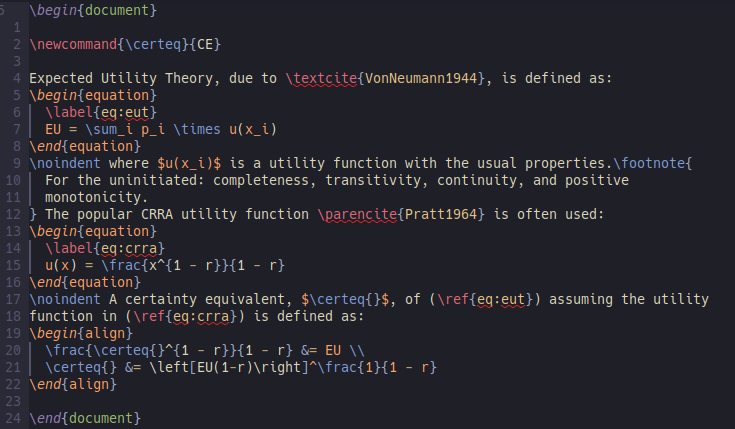
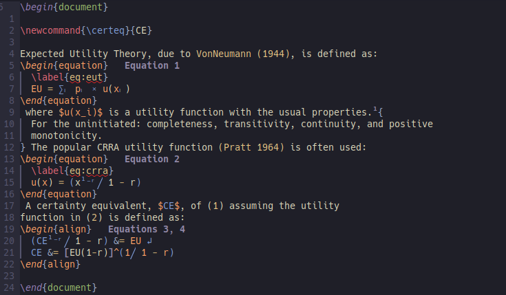

# rnoweb-nvim

A Neovim plugin to conceal commands in Rnoweb and LaTeX documents using Treesitter and Extmarks.

The plugin aims to be substantially quicker than an equivalent using regular
regex concealing (e.g. with the illustrious
[VimTex](https://github.com/lervag/vimtex) plugin).

This plugin also aims to provide niceties to Rnoweb documents (the main reason
I created it). In particular, inline code segments are replaced in-document
provided that their results are included in a `inline` directory.

### Goals
- Be fast. This means using treesitter to do the heavy lifting  
- Multi-character conceal  
- Work with Rnoweb or stand-alone Latex  
- Conceal latex symbols and provide interface for users to specify their own conceals  

### Current Functionality
- Basic citation conceal  
- Inline code substitution for rnoweb  
- Equation numbering  
- Figure numbering  
- Footnote numbering  
- Diacritic replacement  
- Subscript/superscripts  
- Replacement of in document text macros (`\newcommand`'s where the result of the command is only text)  
- Lots of pre-defined conceals for common commands  

### Improvements
- Citation conceal with bibliography lookup and hopefully the anti-conceal functionality. Not doing this before anti-conceal is mainlined.  
- Constant improvements in equation and environment numbering  
- General environment numbering  

# Installation and User Configuration

The following should work with packer. Note that I also configure some
user-specific replacements that appear in the following screenshots. There
aren't necessary for the plugin to work out of the box.

```{lua}

use { 'bamonroe/rnoweb-nvim',
  requires = {
    'nvim-lua/plenary.nvim'
  },
  ft = {'rnoweb', "latex", "tex"},
  dependencies = {
    'nvim-lua/plenary.nvim'
  },
  config = function()
    require('rnoweb-nvim').setup()

    -- Set some of my own symbols that are likely not in anyone else's docs
    local sym = require('rnoweb-nvim.symbols')
    sym.set_sym("latex", "\\gi",    {"g⁻¹"})
    sym.set_sym("latex", "\\@",     {""})
    sym.set_sym("latex", '\\CE',    {"CE"})
    sym.set_sym("latex", '\\CS',    {"ECS"})
    sym.set_sym("latex", '\\Pr',    {"Pr"})
    sym.set_sym("latex", '\\pr',    {"Pr(", ")"})
    sym.set_sym("latex", "\\email", {"✉ :", ""})
    sym.set_sym("latex", "\\gbar",  {"(",   " ︳", ")"})
    sym.set_sym("latex", "\\gbar*", {"",    " ︳", ""})

  end
}

```

The user-configuration function `set_sym` takes as first argument the name of
the language that tree-sitter will be using (basically always latex), and then
the command to be concealed, and finally a table with up to n + 1 entries where
n is the number of arguments for the command.  

The first entry will replace the beginning of the command up to the first
brace, the second entry will replace the first closing argument brace and (if
applicable) the second opening brace, the third argument will replace the
second closing brace and (if applicable) the third opening brace, etc. Thus,
note that fields 2+ can only be of length 2 or less.


# Screenshots

Some example LaTeX without the plugin:  



With the plugin, note numbered equations, sub and superscripts, numbered
footnotes, citation concealment, and inline replacement of `\newcommand` that
defines a text-only replacement:  

